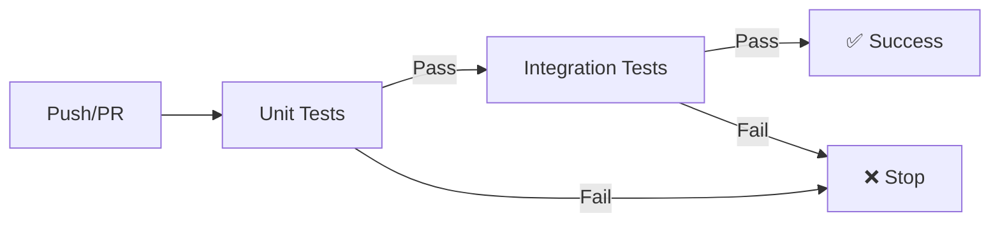
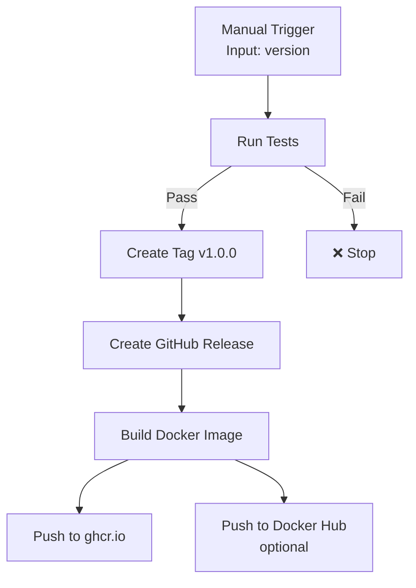

# GitHub Actions Workflows

This directory contains CI/CD workflows for the analytics pipeline.

## Workflows

### 1. **CI - Tests** ([`ci.yml`](ci.yml))

**Trigger**: Every push to any branch, all PRs

**Purpose**: Fast feedback on code changes

**Jobs**:
1. ✅ **Unit Tests** (~3s)
   - No external dependencies
   - Tests algorithm logic
   - 69 tests with mocks and synthetic data

2. ✅ **Integration Tests** (~10s)
   - Requires ClickHouse (service container)
   - Tests database storage
   - 7 tests with real DB operations

3. ✅ **Test Summary**
   - Reports overall status
   - Fails if any tests fail

**Flow**:


### 2. **Create Release and Publish** ([`release.yml`](release.yml))

**Trigger**: Manual (`workflow_dispatch`) with version input

**Purpose**: Create versioned releases with Docker images

**Jobs**:
1. ✅ **Run All Tests**
   - Both unit and integration tests
   - Must pass before release

2. ✅ **Create Git Tag**
   - Creates `v{version}` tag
   - Force-pushes (allows tag updates)

3. ✅ **Create GitHub Release**
   - Extracts notes from CHANGELOG.md
   - Deletes existing release if present
   - Creates new release with tag

4. ✅ **Build & Publish Docker Image**
   - Multi-platform (amd64/arm64)
   - Pushes to GitHub Container Registry (ghcr.io)
   - Optional: Docker Hub (if secrets configured)
   - Tags: `latest`, `v{version}`, `{date-time}`

**Flow**:


## Usage

### Continuous Integration (Automatic)

Every push automatically triggers tests:
```bash
git push origin my-feature-branch
# GitHub Actions runs unit + integration tests
# Green checkmark if all pass ✅
```

### Creating a Release (Manual)

1. **Update CHANGELOG.md** (optional but recommended):
   ```markdown
   ## [1.0.0] - 2025-11-23
   
   ### Added
   - Pattern detection tests
   - GitHub Actions CI/CD
   
   ### Changed
   - Reorganized test structure
   ```

2. **Trigger Release Workflow**:
   - Go to Actions tab in GitHub
   - Select "Create Release and Publish"
   - Click "Run workflow"
   - Enter version (e.g., `1.0.0`)
   - Click "Run workflow"

3. **Wait for Completion**:
   - Tests run first (~15s)
   - Tag created: `v1.0.0`
   - Release created with CHANGELOG notes
   - Docker image built and pushed
   - Available at: `ghcr.io/<org>/analytics-pipeline:v1.0.0`

## Docker Image Tags

After release, the following tags are available:

### GitHub Container Registry (Always)
- `ghcr.io/<org>/analytics-pipeline:latest`
- `ghcr.io/<org>/analytics-pipeline:v1.0.0`
- `ghcr.io/<org>/analytics-pipeline:2025-11-23-1430`

### Docker Hub (Optional - if secrets configured)
- `docker.io/<username>/analytics-pipeline:latest`
- `docker.io/<username>/analytics-pipeline:v1.0.0`
- `docker.io/<username>/analytics-pipeline:2025-11-23-1430`

## Configuration

### Required Secrets

**None** - GitHub Actions works out of the box with `GITHUB_TOKEN`

### Optional Secrets (for Docker Hub)

If you want to also push to Docker Hub:
1. Go to Settings → Secrets → Actions
2. Add secrets:
   - `DOCKERHUB_USERNAME` - Your Docker Hub username
   - `DOCKERHUB_TOKEN` - Docker Hub access token

## Service Containers

### ClickHouse in GitHub Actions

Both workflows use ClickHouse as a service container:
```yaml
services:
  clickhouse:
    image: clickhouse/clickhouse-server:latest
    ports:
      - 8323:8123
      - 9300:9000
    env:
      CLICKHOUSE_DB: test
      CLICKHOUSE_USER: test
      CLICKHOUSE_PASSWORD: test
    options: >-
      --health-cmd "clickhouse-client --user=test --password=test --query='SELECT 1'"
      --health-interval 10s
      --health-timeout 5s
      --health-retries 5
```

This is **fully supported** by GitHub Actions and works reliably.

## Troubleshooting

### Tests Fail in CI but Pass Locally
- Check Python version (CI uses 3.11)
- Verify ClickHouse is running for integration tests
- Check environment variables

### Release Workflow Fails
- Ensure version is valid (e.g., `1.0.0`, not `v1.0.0`)
- Check CHANGELOG.md has entry for the version
- Verify tests pass before release

### Docker Push Fails
- Check `GITHUB_TOKEN` permissions
- For Docker Hub: verify secrets are set correctly
- Check Dockerfile path: `./ops/Dockerfile`

## Best Practices

1. **Always run tests locally first**:
   ```bash
   pytest tests/unit/ -v && pytest tests/integration/ -v
   ```

2. **Use semantic versioning**: `MAJOR.MINOR.PATCH`
   - `MAJOR`: Breaking changes
   - `MINOR`: New features, backwards compatible
   - `PATCH`: Bug fixes

3. **Update CHANGELOG.md** before release

4. **Test in feature branch** before merging to main

5. **Use draft releases** for testing release process

## Monitoring

- View workflow runs: **Actions** tab in GitHub
- Check Docker images: **Packages** tab (right sidebar)
- Monitor test trends: Review test artifacts in each run