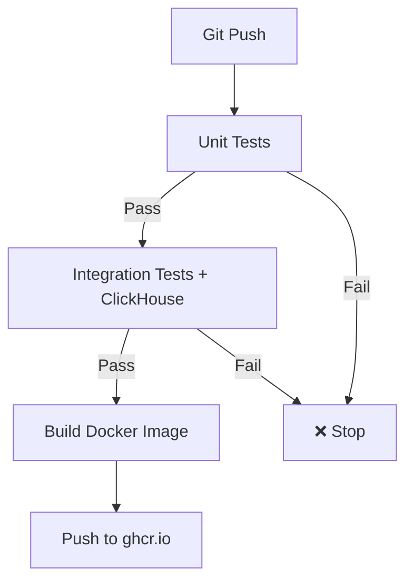

# Test Organization Migration Guide

## What Changed

The pattern detection tests were **incorrectly placed** in `tests/integration/pattern_detection/` but are actually **unit tests** (they use mocks, not real databases).

### Before (Incorrect)
```
tests/
└── integration/
    └── pattern_detection/
        ├── conftest.py (mixed unit & integration fixtures)
        ├── docker-compose.yml
        └── test_*.py (actually unit tests with mocks!)
```

### After (Correct)
```
tests/
├── unit/                          # ✅ Unit tests
│   └── pattern_detection/
│       ├── conftest.py            # Simple fixtures, no DB
│       ├── test_cycle_detection.py
│       ├── test_motif_detection.py
│       ├── test_layering_detection.py
│       ├── test_threshold_detection.py
│       ├── test_proximity_detection.py
│       ├── test_network_detection.py
│       └── test_burst_detection.py
│
└── integration/                   # ✅ Integration tests
    ├── docker-compose.yml         # Shared ClickHouse service
    ├── conftest.py                # DB client fixtures
    └── pattern_detection/         # Future: real E2E tests
```

## Why This Matters

### Unit Tests (tests/unit/)
- **Fast**: Run in seconds
- **No deps**: No ClickHouse, no .env file
- **Mocks**: Use `Mock()` for all repositories
- **Synthetic data**: Generated graphs
- **CI**: Run on every commit
- **Purpose**: Validate algorithm logic

### Integration Tests (tests/integration/)
- **Slower**: Require DB queries
- **Dependencies**: ClickHouse, real data
- **Real repos**: Actual database connections  
- **Real data**: From production or test DB
- **CI**: Run after unit tests pass
- **Purpose**: End-to-end validation

## Files Reorganized

### Moved to tests/unit/pattern_detection/
- ✅ test_cycle_detection.py (528 lines)
- ✅ test_motif_detection.py (542 lines)
- ✅ test_layering_detection.py (503 lines)
- ✅ test_threshold_detection.py (479 lines)
- ✅ test_proximity_detection.py (545 lines)
- ✅ test_network_detection.py (646 lines)
- ✅ test_burst_detection.py (515 lines)

### Shared Infrastructure
- ✅ tests/integration/docker-compose.yml - Moved up from pattern_detection/
- ✅ tests/integration/conftest.py - DB fixtures for integration tests
- ✅ tests/unit/pattern_detection/conftest.py - Simple fixtures for unit tests

### Old Location (Can Be Removed)
The old `tests/integration/pattern_detection/` directory can now be deleted:
```bash
# After verifying tests work in new location
rm -rf tests/integration/pattern_detection/
```

## Running Tests After Migration

### Unit Tests Only (No Setup Required)
```bash
pytest tests/unit/ -v
```

### Integration Tests (Requires ClickHouse)
```bash
# Start ClickHouse
cd tests/integration
docker-compose up -d

# Run tests
cd ../..
pytest tests/integration/ -v

# Stop ClickHouse
cd tests/integration
docker-compose down -v
```

### All Tests
```bash
# Unit first, then integration
pytest tests/unit/ -v && pytest tests/integration/ -v
```

## GitHub Actions Workflow

The new CI/CD workflow ([`.github/workflows/ci.yml`](../.github/workflows/ci.yml)) runs:

1. **Unit Tests** - Fast, no dependencies
2. **Integration Tests** - With ClickHouse service container
3. **Build Docker Image** - Only if all tests pass
4. **Push to ghcr.io** - GitHub Container Registry



## Benefits

✅ **Clear separation** - Unit vs Integration
✅ **Fast CI** - Unit tests run first (fail fast)
✅ **Selective testing** - Run only what you need
✅ **No confusion** - Unit tests don't need Docker
✅ **Standard practice** - Follows pytest conventions
✅ **Better DX** - Clear intent, easier onboarding

## Next Steps

1. Verify unit tests work: `pytest tests/unit/pattern_detection/ -v`
2. Start ClickHouse: `cd tests/integration && docker-compose up -d`
3. Verify integration tests work: `pytest tests/integration/ -v`
4. Delete old directory: `rm -rf tests/integration/pattern_detection/`
5. Commit changes and push to trigger CI/CD

## Questions?

- **Why move?** Tests used mocks (unit) but were labeled integration
- **Do tests still work?** Yes, identical code, just better organized
- **What about DB tests?** They're in unit tests testing DB *storage* logic (not queries)
- **Future integration tests?** Will use real data in tests/integration/pattern_detection/