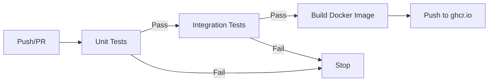

# Integration Tests

Real integration tests that require external services (ClickHouse, etc.).

## Infrastructure

### Docker Compose
Located at [`docker-compose.yml`](docker-compose.yml) - shared by all integration tests.

**Services**:
- ClickHouse Server (latest)
- Ports: 8323 (HTTP), 9300 (Native)
- Database: `test`, User: `test`, Password: `test`

## Running Integration Tests

### Local Development

```bash
# 1. Start services
cd tests/integration
docker-compose up -d

# 2. Wait for ClickHouse to be ready
docker-compose ps

# 3. Run tests
cd ../..
pytest tests/integration/ -v

# 4. Stop services
cd tests/integration
docker-compose down -v
```

### CI/CD (GitHub Actions)

Integration tests run automatically after unit tests pass:
- ClickHouse started as a service container
- Schema migrations run automatically
- Tests execute with real database
- See [`.github/workflows/ci.yml`](../../.github/workflows/ci.yml)

## Current Integration Tests

### Database Storage Tests
Located in various `test_*_stored_in_correct_table()` functions:
- Verify patterns are stored in specialized tables
- Check all required columns exist
- Test data persistence

These are **partially integrated** - they test DB storage but still use synthetic data.

## Future: True End-to-End Tests

Create `tests/integration/pattern_detection/` directory for:
- Tests with real transaction data from source ClickHouse
- Full pipeline execution (ingest → analyze → detect)
- Cross-pattern correlation analysis
- Performance benchmarking with production-scale data

## Fixtures

Shared fixtures in [`conftest.py`](conftest.py):
- `test_clickhouse_client` - Database connection
- `setup_test_schema` - Table creation
- `clean_pattern_tables` - Test isolation
- `test_data_context` - Test parameters

## vs. Unit Tests

| Aspect | Unit Tests | Integration Tests (Here) |
|--------|-----------|--------------------------|
| Speed | <5s | Variable (depends on data) |
| Dependencies | None | ClickHouse required |
| Data | Synthetic | Real or DB-backed |
| Isolation | Perfect | Requires cleanup |
| Purpose | Algorithm logic | System integration |

## CI/CD Workflow



Integration tests run **only if** unit tests pass, ensuring fast feedback.